# Load Test Challenge Workshop

This repository has been forked from the [Azure load test demo](https://github.com/Azure-Samples/nodejs-appsvc-cosmosdb-bottleneck) repository and amended into a challenge-based set of exercises for an interactive workshop to get hands on experience in using Azure load testing on an application.

It uses the sample application and sample load test script in this repository as a starting point.

The demonstration application is an web app hosted in Azure App Services with a Cosmos Database backend. 

The mission is to see if you can get **500 requests per second** from this application without spending more money than is necessary on the Azure resources.

The final challenge is about adapting this to one of your own application or service.


# Challenge One - Create Load Test Resource

This may be done in the Azure portal or using automation. You could also try the [Quickstart](https://docs.microsoft.com/en-us/azure/load-testing/quickstart-create-and-run-load-test)


You need to consider the location of the load testing service with respect to the target system's location. Discuss why this may be important.

So, now we have a load testing service and we have tested it out against a URL, now let's deploy an application in the next challenge.


# Challenge Two - Create a Demo System Under Test

This challenge is about having our own application to test that we can later change to meet our performance requirements.

On a Windows PC, there are three possible destinations for the code:
1. Directly on the Windows PC file system
2. In a Windows Subsystem for Linux (WSL) session
3. Azure Cloud Shell

You need to decide which destination suits you best. Azure Cloud Shell should have all of the tooling installed already.

## Installation

1. Clone this GitHub repository to your PC

```
git clone https://github.com/jometzg/nodejs-appsvc-cosmosdb-bottleneck.git
```

2. In your terminal window, log into Azure and set a subscription(subscription which would contain the webapp) :

        az login
        az account set -s mySubscriptionName

3. Clone the sample application's source repository. The sample application is a Node.js app consisting of an Azure App Service web component and a Cosmos DB database. The repo also contains a PowerShell script that deploys the sample app to your Azure subscription.

        git clone https://github.com/jometzg/nodejs-appsvc-cosmosdb-bottleneck.git

4. Deploy the sample app using the PowerShell script. (Tip: macOS users can install PowerShell [here](https://docs.microsoft.com/en-us/powershell/scripting/install/installing-powershell-core-on-macos?view=powershell-7.1))

        cd SampleApp
        .\deploymentscript.ps1

5. You will be prompted to supply a unique application name and a location (default is `eastus`). **It is best to leave this at 'eastus'**. A resource group for the resources would be created with the same name.
6. Once deployment is complete, browse to the running sample application with your browser.

        https://<app_name>.azurewebsites.net

## Discussion
Once deployed, discuss:
1. the application location
2. the application moving parts and how these may impact the performance of the application.


# Challenge Three - Run a load test against the application

In this challenge, we are going to use the JMeter JMX file from the cloned GitHub repo. This makes a series of requests against the application. So you load test will need to use this script for this challenge.

Follow the [steps](https://docs.microsoft.com/en-gb/azure/load-testing/how-to-create-and-run-load-test-with-jmeter-script#create-a-load-test) to configure a load test in the load test resource you created in challenge one.

You will need to upload the "SampleAppParam.JMX" file from the cloned repository


The SampleApp.JMX file is parameterised, so that the URL of the target application is not defined in the JMX file, but can be injected by JMeter at runtime. The parameter is called "webapp". It will need to be entered in the page shown below:

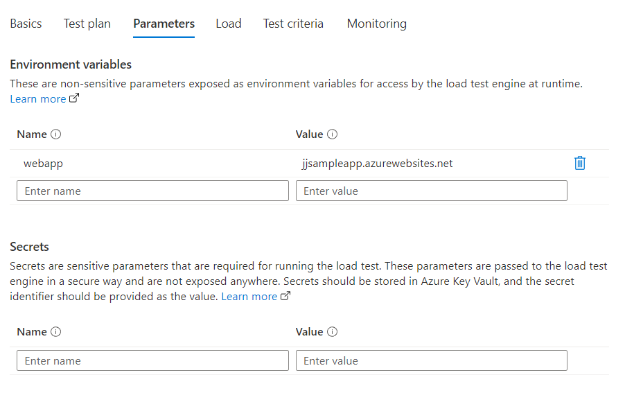

Make sure to also set the monitoring to point to your applications resources. This will allow Azure load testing to capture metrics from this application.

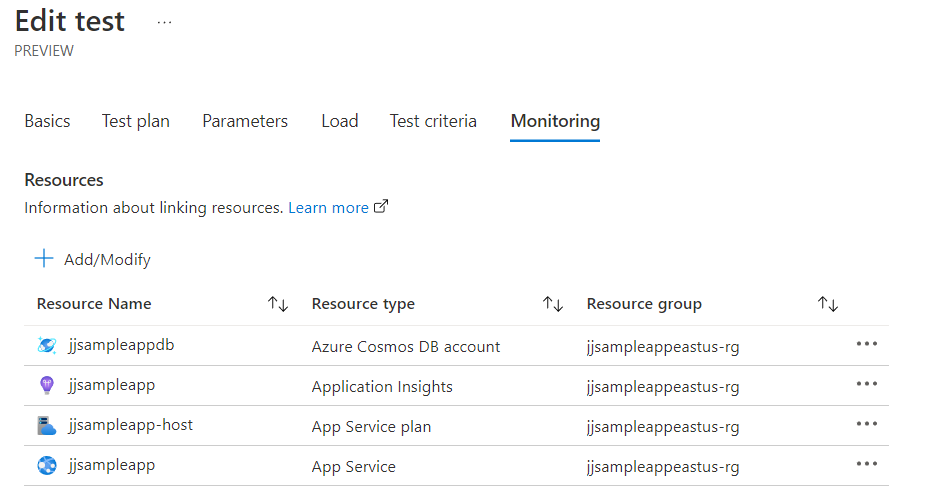

Once the configuration is complete. If the load test has not started, press "Run" and wait.

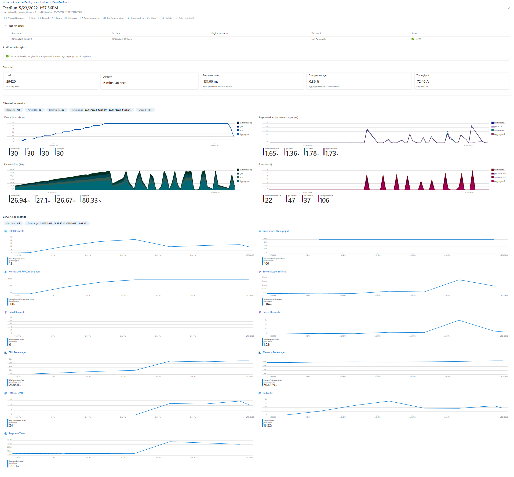

Look closely at the results from the run. Some discussion points:
1. What is the overall request rate
2. Is this what is needed
3. Are there any errors? If, so any ideas why?
4. Look at the Cosmos database metrics

The next step will be to tune the application and re-test to see if we can meet the original target request rate.


# Challenge Four - Tune the application and re-check

For this challenge, we need to be able to hit a higher request rate. Some things to think about:

1. How can we drive more requests into the application
2. What can we alter on the application to improve its throughput?
3. Remember, the application should not be over provisioned as that is a waste of money.

What needed to change to achieve the desired request rate?

When you do multiple test runs, these will all be listed under the same test. You can use the description field to annotate the tests to summarise the changes.

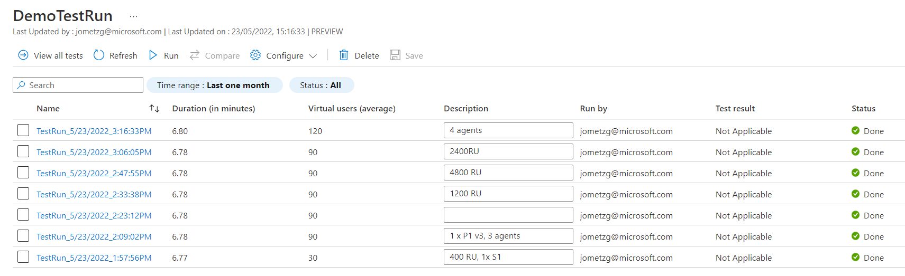

You can also compare different runs to see their differences. This is really useful to see how things have changed between runs.

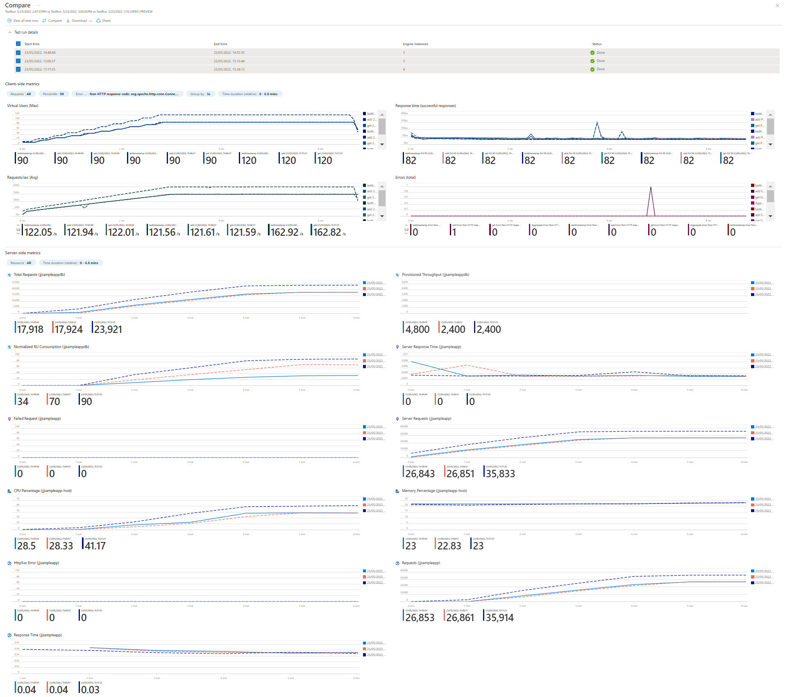

## Discuss
1. Did you hit the target requests per second?
2. What needed to change to do this?


# Challenge Five - Automate load testing in a GitHub Action

You will need to think about:
1. In which GitHub repository to run the action
2. when the action will run
3. How the action step is authenticated
4. How to drive parameters into the test
5. How to set success criteria

The overall approach for building a load testing action is documented [here](https://docs.microsoft.com/en-us/azure/load-testing/tutorial-cicd-github-actions)

This repository has an action built for this, so in your cloned repository look for .github/workflows/worflow.yaml

```
# This is a basic workflow to help you get started with Actions

name: Sample App deploy

# Controls when the workflow will run
on:
  push:
      branches:
        - main

env:
  LOAD_TEST_RESOURCE: "your-loadtest-resource-name"
  LOAD_TEST_RESOURCE_GROUP: "your-loadtest-rg"
  ENDPOINT_URL: "yourwebsite.azurewebsites.net"

# A workflow run is made up of one or more jobs that can run sequentially or in parallel
jobs:

  loadTest:
    name: Load Test
    runs-on: ubuntu-latest
    steps:
      - name: Checkout GitHub Actions 
        uses: actions/checkout@v2
          
      - name: Login to Azure
        uses: azure/login@v1
        continue-on-error: false
        with:
          creds: ${{ secrets.AZURE_CREDENTIALS }}
        
      - name: 'Azure Load Testing'
        uses: azure/load-testing@v1
        with:
          loadTestConfigFile: 'SampleApp.yaml'
          loadTestResource: ${{ env.LOAD_TEST_RESOURCE }}
          resourceGroup: ${{ env.LOAD_TEST_RESOURCE_GROUP }}
          env: |
            [
              {
                 "name": "webapp",
                 "value": "${{env.ENDPOINT_URL}}"
              }
            ]

      - uses: actions/upload-artifact@v2
        with:
          name: loadTestResults
          path: ${{ github.workspace }}/loadTest
```

The workflow has three steps:
1. Authenticate using an Azure AD service principal. This is the "AZURE_CREDENTIALS" GitHub secret. This service principal creation is outside of this pipelien and is documented [here](https://docs.microsoft.com/en-us/azure/load-testing/tutorial-cicd-github-actions#set-up-github-access-permissions-for-azure)
2. Run the load test using the "SampleApp.yaml" - which references the JMeter test file "SampleAppParam.xml"
3. Upload the results

The heart of the load test configuration is the YAML file. It is this that defines the load test to be run

```
version: v0.1
testName: SampleAppTestParam
testPlan: SampleAppParam.jmx
description: 'SampleApp Test Run'
engineInstances: 1
failureCriteria: 
- avg(response_time_ms) > 5000
- percentage(error) > 20
```

If all is correctly configured, any change to the repository will cause the GitHub action to run.

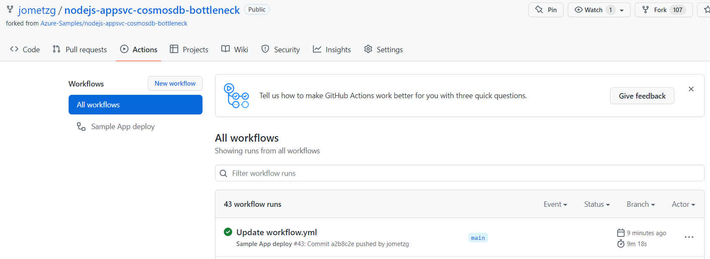

So, now we have a working test that can be run interactively or as part of CI/CD pipeline.

If you have managed to this successfully, all that is left is to apply this to your own application.


# Challenge Six - Generate a JMeter Dashboard of the results

This is an optional challenge. 

The Azure Load Test service is currently in preview. The feature to generate JMeter dashboards has been disabled. In the meantime, if the JMeter HTML dashboard is needed, then it needs to be done directly in JMeter.

How you may generate the JMeter dashboard yourself.

1. You need a copy of JMeter on a PC. The download is https://jmeter.apache.org/download_jmeter.cgi
2. There is a menu to generate an HTML report and command-line options
3. Both of these require the output csv from a test run

Firstly, you need to download the load test results file from the Azure portal. This will be used later whether in the JMeter application or on the command-line. The download is zipped, so will need to be unzipped before it is used.

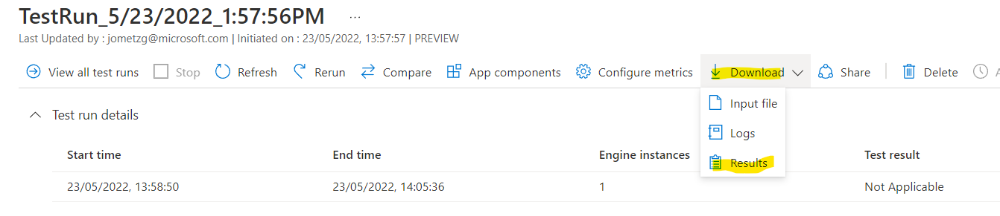

If you want to generate the HTML report interactively, then start JMeter and choose Generate HTML Report. This requires you to add the test results CSV and a default properties file https://github.com/apache/jmeter/blob/master/bin/user.properties 

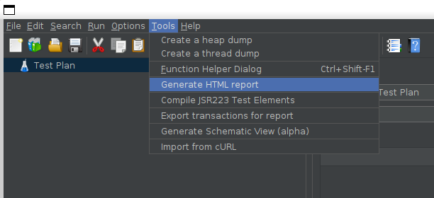

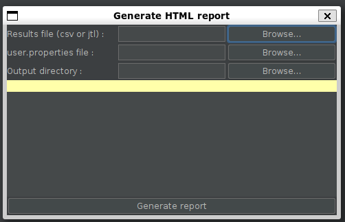

This will then generate a folder holding the HTML to the standard JMeter report.

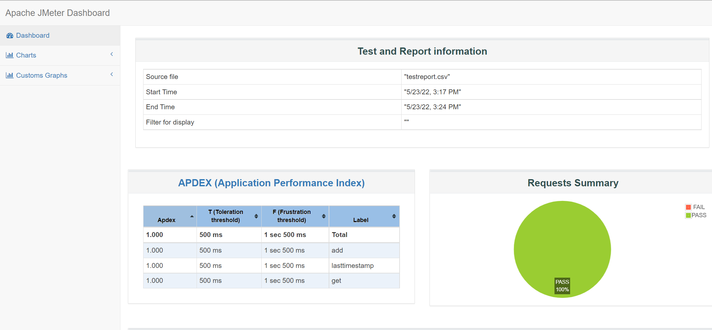

The command line approach is:

```
./jmeter.sh -g testreport.csv -o out
```

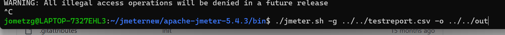


# Challenge Seven - Load test your own application's endpoint

This is where things get more interesting - to apply all of the above to an application of your own. What you will need to do is:
1. Create/amend a JMX file. You can either use the JMeter user interface or use an interactive JMX editor http://jmeter-plugins.org/editor/
2. Run load test interactively
3. Discuss what changes may be needed to the application or test to get better results
4. Automate in GitHub action - setting success criteria
